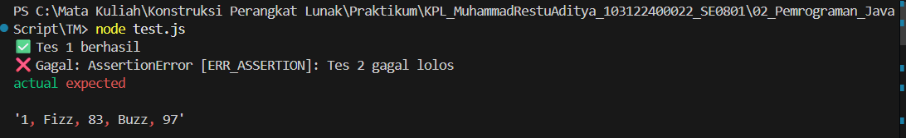
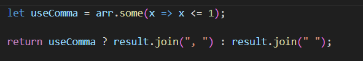
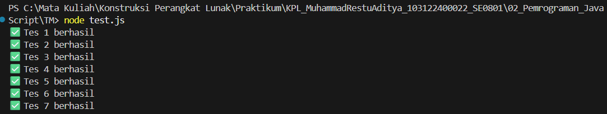

# Tugas Mandiri 02: Pemrograman JavaScript

**Identitas**

Nama : Muhammad Restu Aditya  
NIM : 103122400022  
Kelas : SE0801

---

## Soal

Buatlah sebuah fungsi bernama **fizzBuzz** yang menerima input larik (array) dan mengembalikan deretan bilangan dengan aturan berikut:

- Kelipatan **2** → "Fizz"
- Kelipatan **7** → "Buzz"
- Kelipatan **14** → "FizzBuzz"

Jika bilangan tidak memenuhi kondisi tersebut, maka tampilkan angka tersebut.

Contoh:

Input

[8, 9, 32, 75, 84]

Output

Fizz 9 Fizz 75 FizzBuzz

---

## Kode Sumber

Tersedia di [tm.js](./tm.js)

---

## Output Awal (Terjadi Error)

Saat pertama kali menjalankan file pengujian `test.js`, program tidak berhasil melewati semua pengujian.

Hal ini terjadi karena format output yang dihasilkan program tidak sesuai dengan format yang diharapkan oleh file `test.js`.

---

## Analisis Permasalahan

Setelah dianalisis dari isi file `test.js`, ditemukan bahwa format output yang diminta berbeda pada beberapa test.

Contoh:

Tes 1 menggunakan pemisah **spasi**

Fizz 9 Fizz 75 FizzBuzz

Sedangkan Tes 2 menggunakan pemisah **koma dan spasi**

1, Fizz, 83, Buzz, 97

Karena pada implementasi awal output selalu menggunakan **spasi**, maka test kedua gagal.

---

## Perbaikan Kode

Untuk mengatasi masalah tersebut, kode diperbaiki dengan cara:

1. Menyimpan hasil sementara dalam array
2. Mengecek apakah terdapat nilai **≤ 1** dalam input
3. Menentukan jenis pemisah output menggunakan fungsi `join()`

Berikut adalah bagian kode yang ditambahkan untuk menyesuaikan format output.

---

## Output Setelah Perbaikan

Setelah kode diperbaiki, seluruh test pada `test.js` berhasil dilewati.

---

## Deskripsi Program

Program ini membuat fungsi **fizzBuzz** yang menerima sebuah array angka sebagai input.

Setiap elemen dalam array diperiksa menggunakan operasi modulus (%).

Aturannya adalah:

- Jika angka merupakan kelipatan **14**, maka menghasilkan "FizzBuzz"
- Jika angka merupakan kelipatan **2**, maka menghasilkan "Fizz"
- Jika angka merupakan kelipatan **7**, maka menghasilkan "Buzz"
- Jika tidak memenuhi kondisi di atas, maka angka tersebut ditampilkan apa adanya

Selain itu program juga melakukan **validasi input**, sehingga jika input yang diberikan bukan berupa array, maka fungsi akan mengembalikan pesan **"Input tidak valid"**.

Dengan perbaikan pada format output, program berhasil menyesuaikan hasil dengan pola yang terdapat pada file `test.js` sehingga seluruh pengujian dapat dilewati dengan benar.
