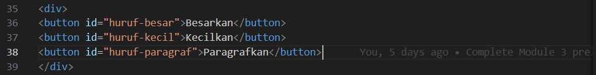
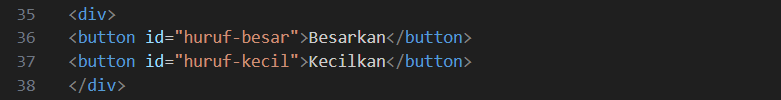
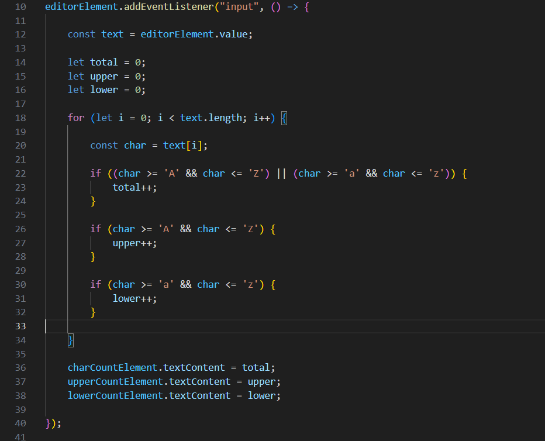
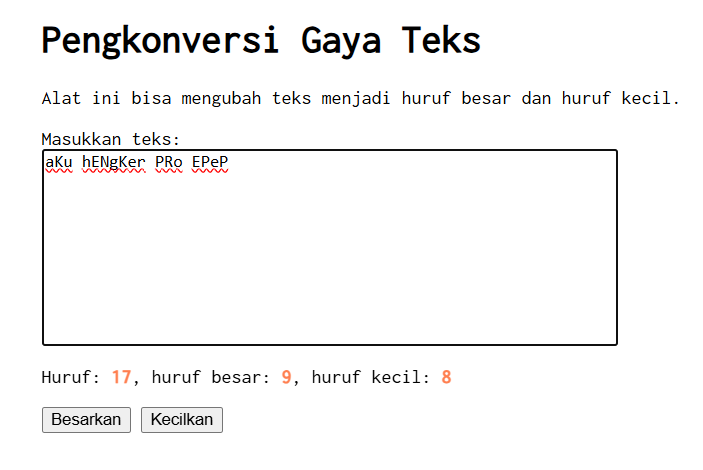
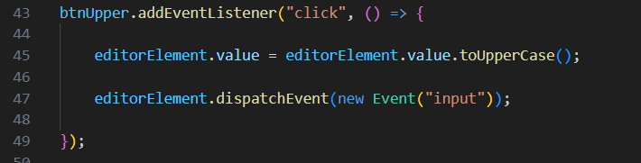
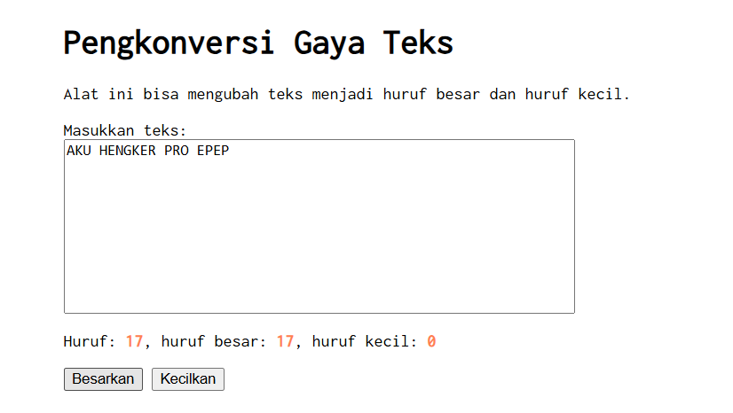
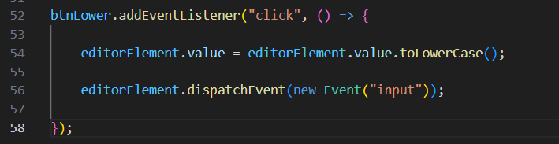
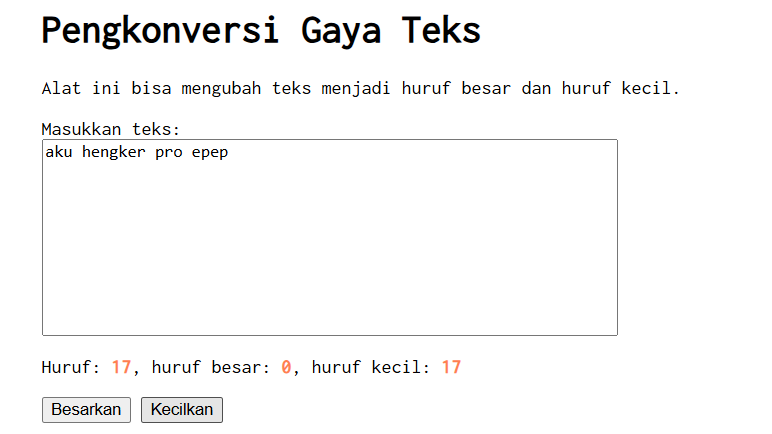

# Tugas Mandiri 03: GUI dengan HTML, CSS, dan JavaScript

## Identitas

Nama : Muhammad Restu Aditya  
NIM : 103122400022  
Kelas : SE0801  

---

## Soal

Setelah menyelesaikan tugas pendahuluan, tambahkan fungsi pada program untuk:

1. Menghitung jumlah **huruf kecil** dan **huruf besar** yang ditampilkan pada elemen `#hk` & `#hb`
2. Mengubah teks menjadi **huruf besar** ketika tombol `#huruf-besar` ditekan
3. Mengubah teks menjadi **huruf kecil** ketika tombol `#huruf-kecil` ditekan

Hasil perubahan teks pada nomor 2 dan 3 harus ditampilkan kembali pada **editor teks (`#editor-kecil`)**.

Selain itu, fitur **"Paragrafkan"** harus dihapus dari alat.

---

## Kode Sumber

Tersedia di:

- [index.html](../index.html)  
- [index.css](../index.css)  
- [index.js](../index.js)  

---

# Perubahan 1: Menghapus Fitur Paragrafkan

Pada tugas sebelumnya terdapat tombol **Paragrafkan** yang berfungsi untuk mengubah teks menjadi bentuk paragraf.

Pada tugas ini fitur tersebut **dihapus** karena tidak lagi diperlukan sesuai dengan instruksi tugas.

### Kode Sebelum Perubahan

### Kode Setelah Perubahan

---

# Perubahan 2: Menghitung Huruf Kecil Dan Besar

Program diperbarui agar dapat menghitung jumlah **huruf kecil** dan **huruf besar** yang dimasukkan oleh pengguna.

Perhitungan dilakukan dengan memeriksa setiap karakter dalam teks dan menghitung karakter yang berada pada rentang **a sampai z**.

### Kode Perhitungan Huruf Kecil Dan Besar

---

## Penjelasan

Pada kode tersebut dilakukan beberapa langkah:

- Mengambil teks dari elemen `textarea`
- Melakukan perulangan untuk memeriksa setiap karakter
- Jika karakter berada di antara `'a'` dan `'z'`, maka nilai **huruf kecil** akan bertambah
- Jika karakter berada di antara `'A'` dan `'Z'`, maka nilai **huruf besar** akan bertambah
- Hasil perhitungan ditampilkan pada elemen `#hk` untuk huruf kecil, dan `#hb` untuk huruf besar

---

### Contoh Hasil Perhitungan

---

# Perubahan 3: Menambahkan Fungsi Tombol Huruf Besar

Fungsi ini digunakan untuk mengubah seluruh teks menjadi **huruf besar** ketika tombol **Besarkan** ditekan.

Perubahan dilakukan menggunakan fungsi JavaScript `toUpperCase()`.

### Kode Fungsi Huruf Besar

---

## Hasil Perubahan Huruf Besar

---

# Perubahan 4: Menambahkan Fungsi Tombol Huruf Kecil

Selain huruf besar, program juga dapat mengubah teks menjadi **huruf kecil** menggunakan tombol **Kecilkan**.

Perubahan ini dilakukan menggunakan fungsi JavaScript `toLowerCase()`.

### Kode Fungsi Huruf Kecil

---

## Hasil Perubahan Huruf Kecil

---

# Deskripsi Program

Program ini merupakan sebuah halaman web sederhana yang dibuat menggunakan **HTML, CSS, dan JavaScript**.

Halaman ini berfungsi sebagai alat untuk mengubah gaya teks yang dimasukkan oleh pengguna serta menghitung jumlah huruf yang terdapat dalam teks tersebut.

Pengguna dapat memasukkan teks ke dalam **textarea**, kemudian program akan secara otomatis menghitung jumlah huruf, huruf besar, dan huruf kecil menggunakan JavaScript.

Selain itu, program menyediakan dua tombol utama yaitu **Besarkan** dan **Kecilkan** yang berfungsi untuk mengubah teks menjadi huruf besar atau huruf kecil.

- **HTML** digunakan untuk membuat struktur halaman seperti judul, textarea, informasi jumlah huruf, dan tombol kontrol.
- **CSS** digunakan untuk mengatur tampilan halaman, termasuk penggunaan font **Inconsolata** dari Google Fonts serta pengaturan posisi elemen agar berada di tengah halaman menggunakan **Flexbox**.
- **JavaScript** digunakan untuk menangani interaksi pengguna, menghitung jumlah huruf, serta melakukan perubahan teks menjadi huruf besar atau huruf kecil.

Dengan penerapan tersebut, halaman web dapat digunakan sebagai alat sederhana untuk mengolah teks sesuai dengan kebutuhan pengguna.

