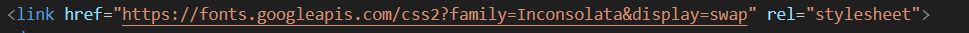
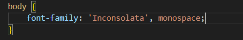
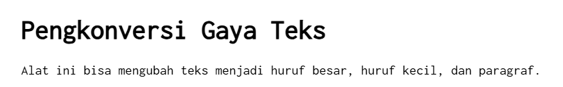
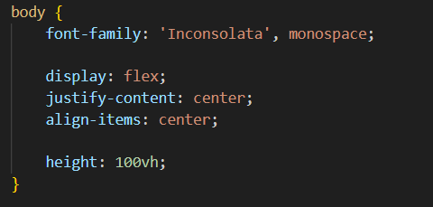

# Tugas Pendahuluan 03: GUI dengan HTML dan CSS

## Identitas

Nama : Muhammad Restu Aditya  
NIM : 103122400022  
Kelas : SE0801

---

## Soal

Buatlah tata letak laman yang kamu buat berada di tengah seperti pada contoh, dan juga ubah font-nya menggunakan **Inconsolata** dari Google Fonts.

---

## Kode Sumber

Tersedia di:

- [index.html](../index.html)  
- [index.css](../index.css)  
- [index.js](../index.js)

---

# Perubahan 1: Mengubah Font menggunakan Google Fonts

Untuk mengubah font halaman, digunakan font **Inconsolata** dari Google Fonts.

Pertama, tambahkan link Google Fonts pada bagian `<head>` di file **index.html**.

### Kode yang Ditambahkan

Kemudian font tersebut diterapkan pada halaman melalui file **index.css**.

### Kode CSS

### Hasil Perubahan Font

---

# Perubahan 2: Membuat Tata Letak Halaman Berada di Tengah

Agar seluruh konten halaman berada di tengah layar, digunakan **Flexbox** pada elemen `body`.

### Kode Flexbox

---

## Penjelasan

- `display: flex` digunakan untuk mengaktifkan sistem layout **Flexbox**  
- `justify-content: center` untuk memposisikan elemen secara **horizontal di tengah**  
- `align-items: center` untuk memposisikan elemen secara **vertikal di tengah**  
- `height: 100vh` agar tinggi `body` mengikuti tinggi layar

---

# Output Akhir

Setelah perubahan dilakukan, tampilan halaman menjadi berada di tengah dan menggunakan font **Inconsolata** sesuai dengan instruksi pada tugas pendahuluan.

---

# Deskripsi Program

Program ini merupakan sebuah halaman web sederhana yang dibuat menggunakan **HTML, CSS, dan JavaScript**.

Halaman ini berfungsi sebagai alat untuk mengubah gaya teks yang dimasukkan oleh pengguna. Pengguna dapat memasukkan teks ke dalam **textarea**, kemudian program akan menghitung jumlah huruf yang dimasukkan secara otomatis menggunakan JavaScript.

- **HTML** digunakan untuk membuat struktur halaman seperti judul, textarea, label, dan tombol.  
- **CSS** digunakan untuk mengatur tampilan halaman, termasuk mengubah font menggunakan Google Fonts serta mengatur posisi elemen agar berada di tengah halaman menggunakan **Flexbox**.

Dengan penerapan tersebut, halaman web dapat tampil lebih rapi dan sesuai dengan contoh tampilan yang diberikan pada modul.