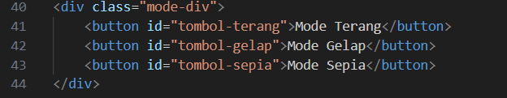
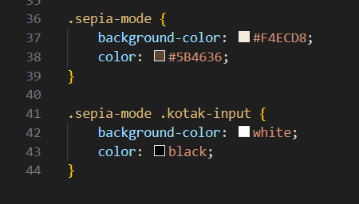
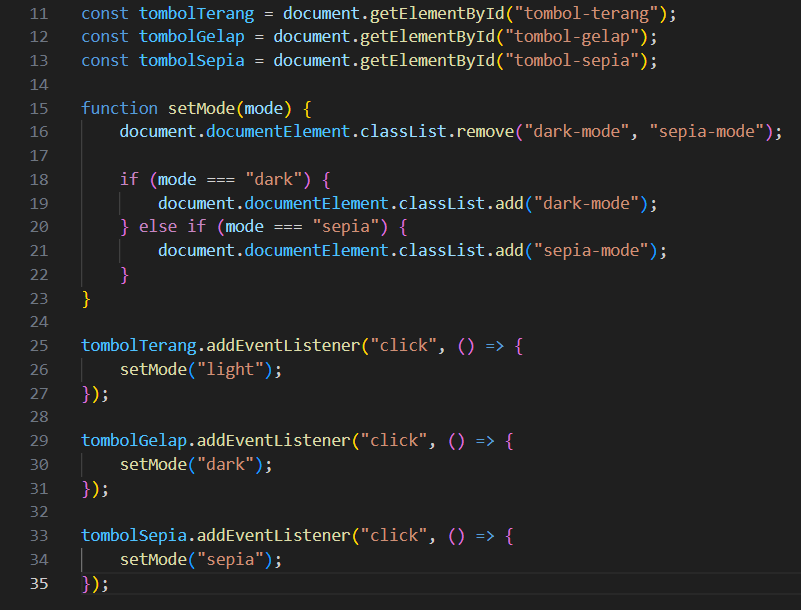
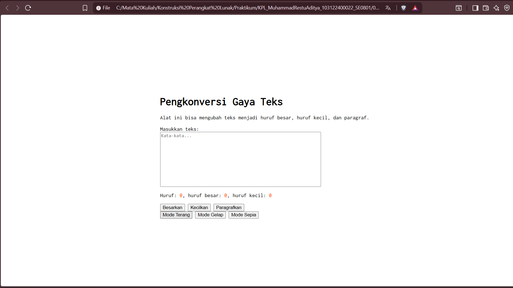
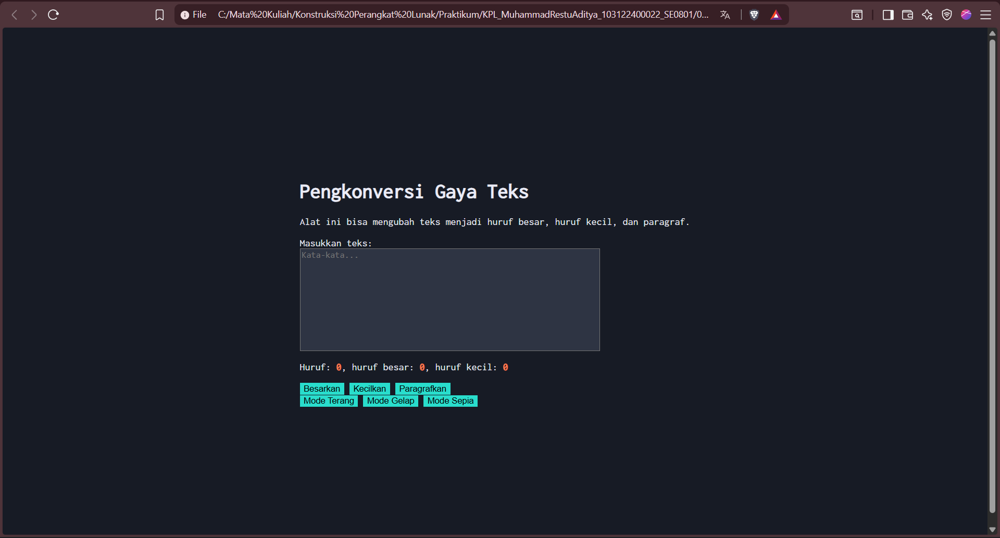
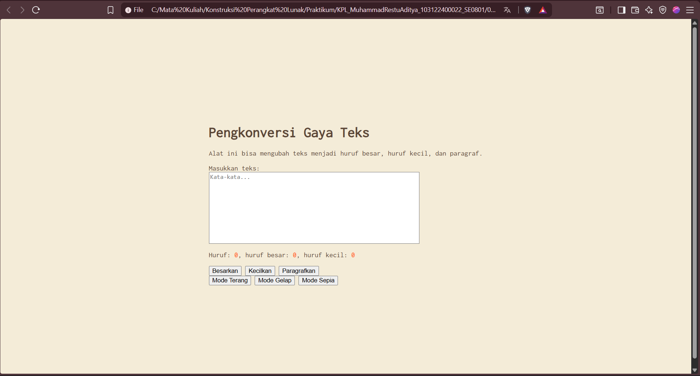

# Tugas Mandiri 04: Automata dan Table-Driven Construction

## Identitas

Nama : Muhammad Restu Aditya  
NIM : 103122400022  
Kelas : SE0801  

---

## Soal

Tambahkan fitur **mode sepia** pada halaman web dengan ketentuan:

- Warna latar belakang: `#F4ECD8`  
- Warna teks: `#5B4636`  
- Form (textarea) tetap berwarna putih  

Ketentuan tambahan:
1. Bagian `mode-div` harus memiliki tiga tombol: **light, dark, sepia**  
2. Perpindahan state harus berjalan dengan benar:
   - sepia → `sepia-mode`  
   - dark → `dark-mode`  
   - light → `light-mode` (default tanpa class tambahan)  

---

## Kode Sumber

Tersedia di:

- [index.html](../index.html)  
- [index.css](../index.css)  
- [index.js](../index.js)

---

# Perubahan: Menambahkan Mode Sepia dan Sistem Multi-State

Pada tugas ini, program dikembangkan dengan menambahkan **mode sepia** serta sistem pengelolaan state tampilan yang lebih terstruktur.

---

## 1. Menambahkan Tombol Mode Sepia

Pada file **index.html**, ditambahkan tombol baru untuk mode sepia.

### Kode HTML

---

## 2. Menambahkan Styling Mode Sepia

Pada file **index.css**, ditambahkan class `sepia-mode` untuk mengatur tampilan.

### Kode CSS

---

## Penjelasan CSS

- `.sepia-mode` mengubah warna latar belakang dan teks utama  
- `.sepia-mode .kotak-input` menjaga agar textarea tetap berwarna putih sesuai ketentuan  

---

## 3. Implementasi Sistem State pada JavaScript

Pada file **index.js**, digunakan pendekatan berbasis fungsi untuk mengatur state tampilan.

### Kode JavaScript

---

## Penjelasan JavaScript

- Fungsi `setMode()` digunakan untuk mengatur state tampilan  
- Sebelum menambahkan mode baru, semua mode sebelumnya dihapus terlebih dahulu  
- Hal ini memastikan hanya **satu state aktif dalam satu waktu**  

Pendekatan ini sesuai dengan konsep **Finite State Machine (FSM)**.

---

# Konsep Automata

Implementasi ini mencerminkan konsep automata sebagai berikut:

- **State**:  
  - Light Mode  
  - Dark Mode  
  - Sepia Mode  

- **Transition**:  
  - Klik tombol mode  

- **Store**:  
  - Class pada elemen `<html>`  

Dengan demikian, sistem UI ini dapat dianggap sebagai **finite state machine sederhana**.

---

# Output Program

## Mode Terang

## Mode Gelap

## Mode Sepia

---

# Deskripsi Program

Program ini merupakan pengembangan dari tugas sebelumnya dengan menambahkan beberapa mode tampilan (multi-theme).

Halaman web ini dibuat menggunakan:
- **HTML** untuk struktur  
- **CSS** untuk styling dan pengaturan tema  
- **JavaScript** untuk interaksi dan pengelolaan state  

Dengan adanya tiga mode tampilan, pengguna dapat memilih tampilan yang sesuai dengan preferensi mereka.

---

# Kesimpulan

Dengan menambahkan mode sepia dan sistem multi-state:

- Program menjadi lebih fleksibel dengan tiga pilihan tampilan  
- Konsep **state dan transisi** dalam automata dapat diterapkan secara nyata  
- Penggunaan fungsi `setMode()` membuat kode lebih rapi dan mudah dikembangkan  

---