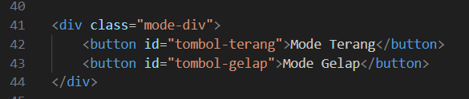
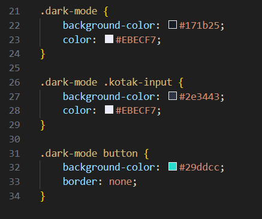
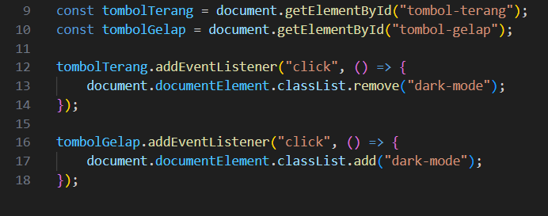
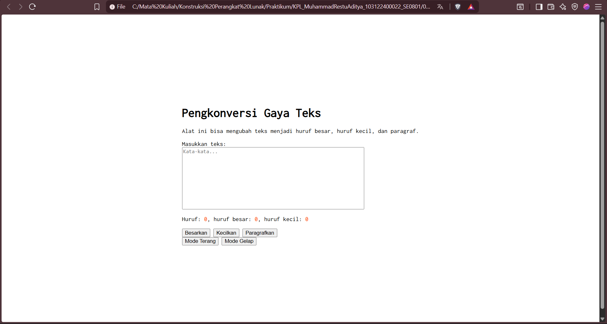
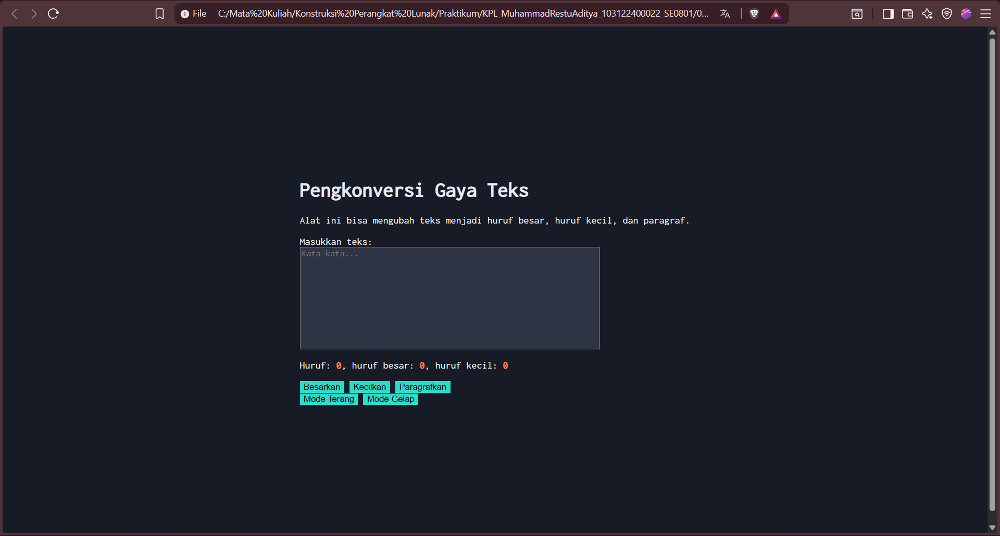

# Tugas Pendahuluan 04: Automata dan Table-Driven Construction

## Identitas

Nama : Muhammad Restu Aditya  
NIM : 103122400022  
Kelas : SE0801  

---

## Soal

Tambahkan fitur **mode gelap** pada halaman web, termasuk pada elemen **editor-kecil (textarea)** dan tombol-tombolnya.

Ketentuan:
- Warna latar belakang editor: `#2e3443`
- Warna tombol: `#29ddcc`
- Warna teks tombol tetap mengikuti warna sebelumnya
- Hilangkan border pada tombol

---

## Kode Sumber

Tersedia di:

- [index.html](../index.html)  
- [index.css](../index.css)  
- [index.js](../index.js)

---

# Perubahan: Menambahkan Mode Gelap (Dark Mode)

Untuk menambahkan fitur mode gelap, digunakan konsep **state** dengan memanfaatkan class CSS bernama `dark-mode`.

Mode gelap akan aktif ketika class tersebut ditambahkan ke elemen `<html>`.

---

## 1. Menambahkan Tombol Mode

Pada file **index.html**, ditambahkan dua tombol untuk mengubah mode tampilan.

### Kode HTML

---

## 2. Menambahkan Styling Mode Gelap

Pada file **index.css**, dibuat beberapa aturan untuk mengubah tampilan saat mode gelap aktif.

### Kode CSS

---

## Penjelasan CSS

- `.dark-mode` digunakan untuk mengubah latar belakang dan warna teks utama  
- `.dark-mode .kotak-input` digunakan agar textarea ikut berubah warna  
- `.dark-mode button` digunakan untuk mengubah warna tombol dan menghilangkan border  

---

## 3. Menambahkan Interaksi JavaScript

Pada file **index.js**, digunakan event listener untuk menangani klik tombol mode.

### Kode JavaScript

---

## Penjelasan JavaScript

- `document.documentElement` merepresentasikan elemen `<html>`  
- `classList.add("dark-mode")` digunakan untuk mengaktifkan mode gelap  
- `classList.remove("dark-mode")` digunakan untuk kembali ke mode terang  

Dengan pendekatan ini, perubahan tampilan dapat dilakukan dengan mudah hanya melalui manipulasi class.

---

# Output Program

## Mode Terang

## Mode Gelap

---

# Deskripsi Program

Program ini merupakan pengembangan dari tugas sebelumnya dengan menambahkan fitur **mode gelap** pada halaman web.

Halaman ini dibuat menggunakan:
- **HTML** untuk struktur halaman  
- **CSS** untuk tampilan dan styling, termasuk mode gelap  
- **JavaScript** untuk interaksi pengguna dan pengelolaan state  

Fitur mode gelap diimplementasikan menggunakan konsep **state**, di mana perubahan tampilan dikontrol melalui penambahan atau penghapusan class `dark-mode` pada elemen utama.

Dengan pendekatan ini, program menjadi lebih modular dan mudah dikembangkan, serta memberikan pengalaman pengguna yang lebih baik.

---

# Kesimpulan

Dengan menambahkan fitur mode gelap:
- Tampilan menjadi lebih fleksibel (light & dark mode)  
- Konsep **state** dapat diterapkan dalam pengembangan UI  
- Penggunaan **class CSS + JavaScript** membuat implementasi lebih sederhana dan terstruktur  

---