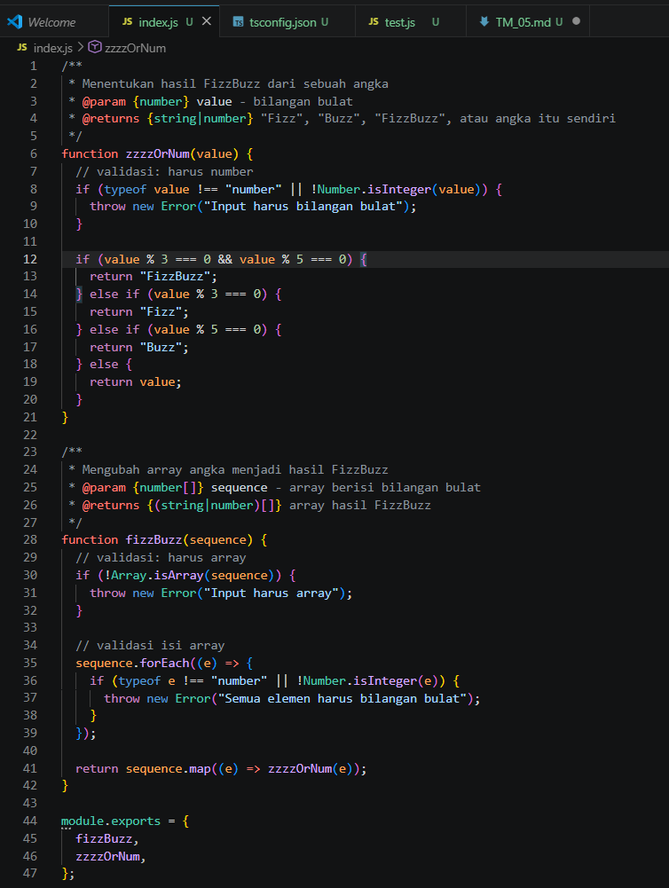
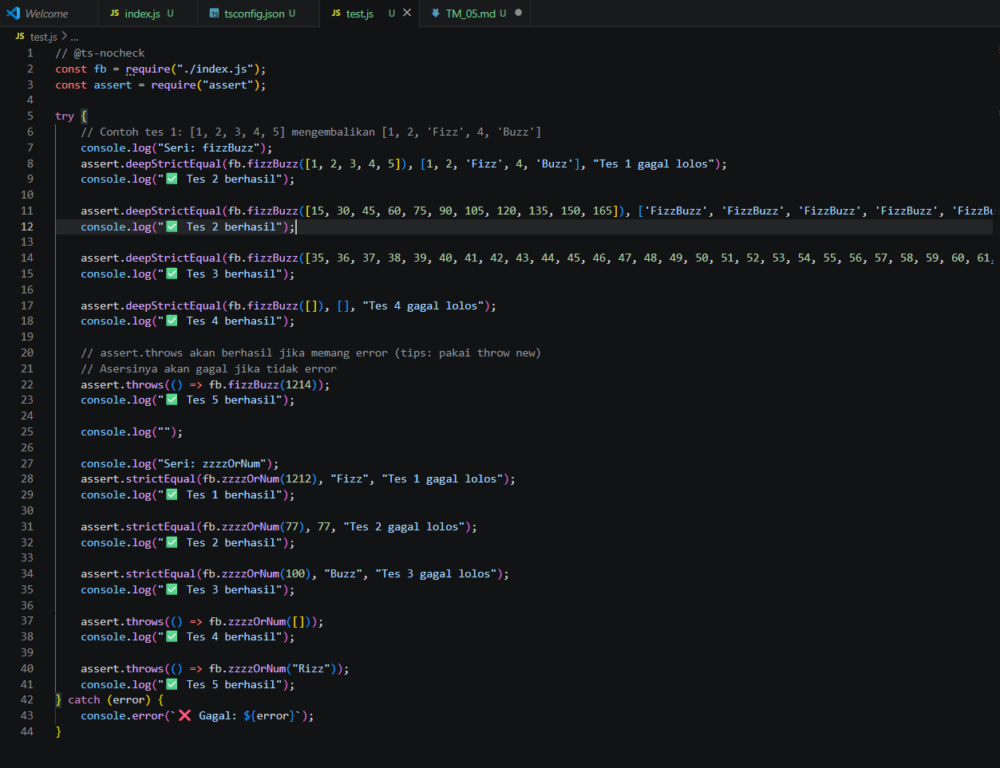
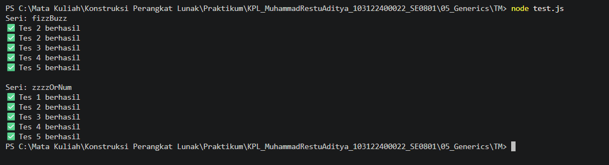

# Tugas Mandiri 05: FizzBuzz

## Identitas

Nama : Muhammad Restu Aditya  
NIM : 103122400022  
Kelas : SE0801  

---

## Soal

Buatlah dua buah fungsi:

1. `zzzzOrNum(value)`
   - Menerima satu bilangan bulat
   - Mengembalikan:
     - "Fizz" jika habis dibagi 3
     - "Buzz" jika habis dibagi 5
     - "FizzBuzz" jika habis dibagi 3 dan 5
     - angka itu sendiri jika tidak memenuhi kondisi

2. `fizzBuzz(sequence)`
   - Menerima array berisi bilangan bulat
   - Mengembalikan array baru berisi hasil dari fungsi `zzzzOrNum`

Ketentuan:
- Harus menggunakan JSDoc
- Harus menggunakan fungsi `zzzzOrNum` di dalam `fizzBuzz`
- Harus melakukan validasi input

---

## Kode Sumber

Tersedia di:

- [index.js](../index.js)

---

# Implementasi Program

## Kode Program

---

## Penjelasan Kode

### Fungsi `zzzzOrNum`
- Digunakan untuk menentukan hasil FizzBuzz dari satu angka
- Melakukan validasi:
  - Input harus berupa number
  - Harus bilangan bulat
- Menggunakan operator modulo `%` untuk mengecek kelipatan

### Fungsi `fizzBuzz`
- Digunakan untuk memproses array
- Melakukan validasi:
  - Input harus berupa array
  - Semua elemen harus number
- Menggunakan `.map()` untuk memanggil `zzzzOrNum` pada setiap elemen

---

# Pengujian Program

## Kode Testing

---

## Hasil Output

Keterangan:
- Array berhasil dikonversi menjadi format FizzBuzz
- Semua test case berhasil dijalankan tanpa error
- Error handling berjalan sesuai harapan

---

# Konsep yang Digunakan

## 1. Higher Order Function
Penggunaan `.map()` untuk memproses array.

## 2. Modular Function
Fungsi dipisah menjadi:
- `zzzzOrNum` (logika utama)
- `fizzBuzz` (pengolahan array)

## 3. Error Handling
Menggunakan `throw new Error()` untuk validasi input.

## 4. JSDoc
Digunakan untuk dokumentasi tipe data agar sesuai dengan TypeScript checking.

---

# Deskripsi Program

Program ini merupakan implementasi dari algoritma FizzBuzz menggunakan JavaScript.

Program terdiri dari dua fungsi utama:
- Fungsi untuk memproses satu angka
- Fungsi untuk memproses array

Program juga dilengkapi dengan validasi input untuk memastikan data yang diproses sesuai.

---

# Kesimpulan

- Pemisahan fungsi membuat kode lebih modular dan mudah dipahami  
- Validasi input penting untuk mencegah error saat runtime  
- Penggunaan `.map()` mempermudah pengolahan array  
- JSDoc membantu dalam dokumentasi dan pengecekan tipe data  

---