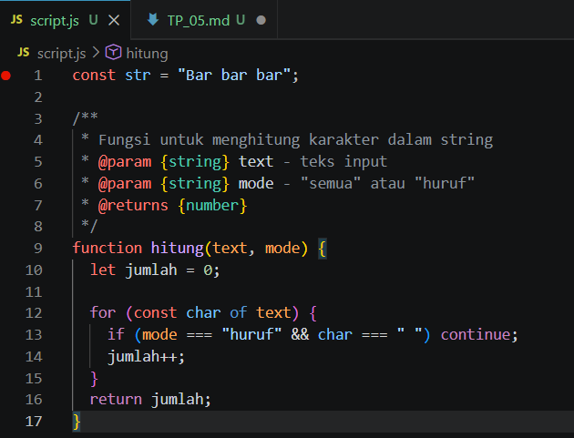
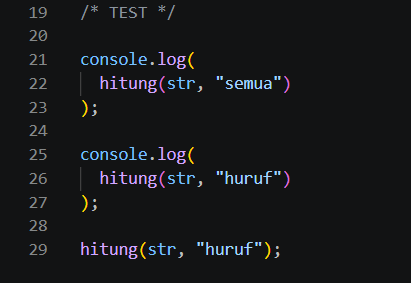
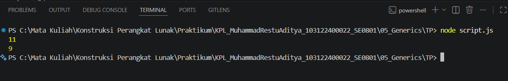

# Tugas Pendahuluan 05: Generics

## Identitas

Nama : Muhammad Restu Aditya  
NIM : 103122400022  
Kelas : SE0801  

---

## Soal

Buatlah sebuah fungsi **generic** yang dapat menghitung:

- Jumlah semua karakter dalam string  
- Jumlah huruf saja (tanpa menghitung spasi)  

Fungsi harus menggunakan satu implementasi yang dapat menangani kedua kasus tersebut.

---

## Kode Sumber

Tersedia di:

- [script.js](../script.js)

---

# Implementasi Fungsi Generic

Fungsi dibuat dengan dua parameter:
- `text` → input string  
- `mode` → menentukan jenis perhitungan ("semua" atau "huruf")  

### Kode Program

---

## Penjelasan Kode

- Menggunakan perulangan `for...of` untuk membaca setiap karakter  
- Jika mode `"huruf"`, maka spasi (`' '`) tidak dihitung  
- Jika mode `"semua"`, semua karakter dihitung  
- Hasil akhir dikembalikan menggunakan `return`  

Pendekatan ini membuat fungsi bersifat fleksibel.

---

# Pengujian Program

### Kode Testing

---

## Hasil Output

Keterangan:
- `hitung(str, "semua")` menghasilkan **11**  
- `hitung(str, "huruf")` menghasilkan **9**

---

# Konsep Generics

Generics adalah konsep di mana sebuah fungsi dapat digunakan untuk berbagai kebutuhan.

Pada program ini:
- Fungsi `hitung()` digunakan untuk dua jenis perhitungan  
- Perilaku fungsi ditentukan oleh parameter `mode`  

Hal ini menunjukkan bahwa fungsi bersifat umum (generic).

---

# Deskripsi Program

Program ini merupakan implementasi sederhana dari konsep **generic function** menggunakan JavaScript.

Program menerima input berupa string, lalu menghitung jumlah karakter berdasarkan mode yang dipilih.

---

# Kesimpulan

- Fungsi generic membuat kode lebih efisien  
- Satu fungsi dapat digunakan untuk berbagai kebutuhan  
- Parameter dapat digunakan untuk mengatur perilaku fungsi  

---