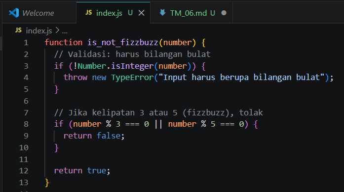
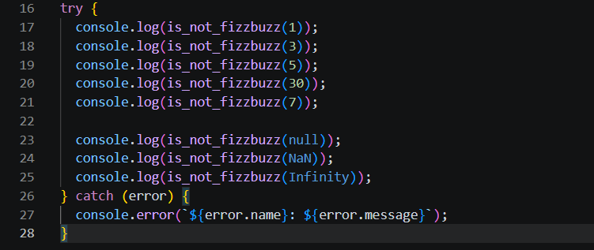
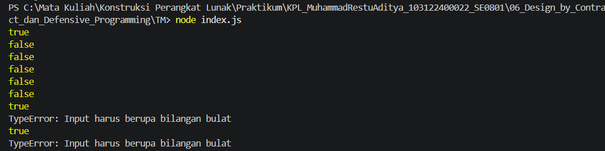

# Tugas Mandiri 06: Defensive Programming (FizzBuzz Filter)

## Identitas

Nama : Muhammad Restu Aditya  
NIM : 103122400022  
Kelas : SE0801  

---

## Soal

Buat fungsi `is_not_fizzbuzz(number)` dengan ketentuan:

- Menolak angka yang termasuk kategori **FizzBuzz**
  - Kelipatan 3
  - Kelipatan 5
  - Kelipatan 15
- Mengembalikan:
  - `false` → jika termasuk fizzbuzz
  - `true` → jika bukan fizzbuzz
- Melempar **TypeError** jika:
  - Input bukan number
  - Bukan bilangan bulat
  - Nilai tidak valid (`NaN`, `Infinity`, dll)

---

## Kode Sumber

Tersedia di:

- [index.js](../index.js)

---

# Implementasi Program

## Kode Program



---

## Penjelasan Kode

### Fungsi `is_not_fizzbuzz`

Fungsi ini digunakan untuk mengecek apakah suatu angka **bukan termasuk kategori fizzbuzz**.

#### 1. Validasi Input
```javascript
if (!Number.isInteger(number)) {
  throw new TypeError("Input harus berupa bilangan bulat");
}
```
Menggunakan Number.isInteger() untuk memastikan:
tipe data number
bukan desimal
bukan NaN, Infinity, atau null

Jika tidak valid → langsung lempar error

#### 2. Logika FIzzBuzz
```Js
if (number % 3 === 0 || number % 5 === 0) {
  return false;
}
```
% digunakan untuk cek kelipatan
Jika habis dibagi 3 atau 5 → termasuk fizzbuzz → ditolak

### 3. Return Default
```Js
return true;
```
Jika lolos semua kondisi maka angka valid 

# Pengujian Program

## Kode Testing



---

## Hasil Output



---

## Skenario Pengujian

| Input     | Output     | Keterangan               |
|----------|-----------|--------------------------|
| 1        | true      | Bukan fizzbuzz           |
| 3        | false     | Kelipatan 3              |
| 5        | false     | Kelipatan 5              |
| 30       | false     | Kelipatan 3 dan 5        |
| 7        | true      | Bukan fizzbuzz           |
| null     | TypeError | Bukan bilangan           |
| NaN      | TypeError | Nilai tidak valid        |
| Infinity | TypeError | Bukan bilangan terbatas  |

---

# Konsep yang Digunakan

## 1. Defensive Programming

- Validasi input sebelum diproses  
- Mencegah error lebih awal  

---

## 2. Error Handling

Kode:
throw new TypeError(...)

Penjelasan:
- Digunakan untuk menangani input tidak valid  
- Memberikan pesan error yang jelas  

---

## 3. Validasi Tipe Data

- Menggunakan `Number.isInteger()` untuk memastikan input aman  
- Menghindari bug dari tipe data yang tidak terduga  

---

## 4. Logika Modulo

- Operator `%` digunakan untuk menentukan kelipatan angka  

---

# Deskripsi Program

Program ini merupakan implementasi konsep **defensive programming** pada studi kasus sederhana FizzBuzz.

Berbeda dengan FizzBuzz biasa yang menghasilkan string, program ini berfokus pada:

- Validasi input  
- Penolakan kondisi tertentu (fizzbuzz)  

Program memastikan bahwa hanya data yang valid yang diproses, sehingga lebih aman digunakan dalam sistem yang lebih besar.

---

# Kesimpulan

- Defensive programming membantu mencegah error sejak awal  
- Validasi input sangat penting untuk menjaga kestabilan program  
- Error handling membuat program lebih aman dan informatif  
- Logika sederhana menjadi lebih kuat jika dikombinasikan dengan validasi yang baik  