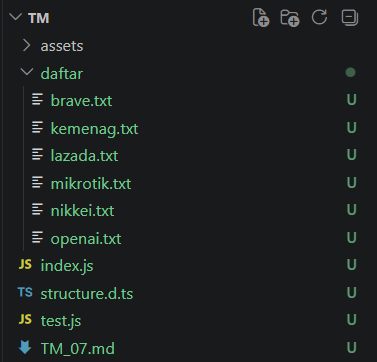
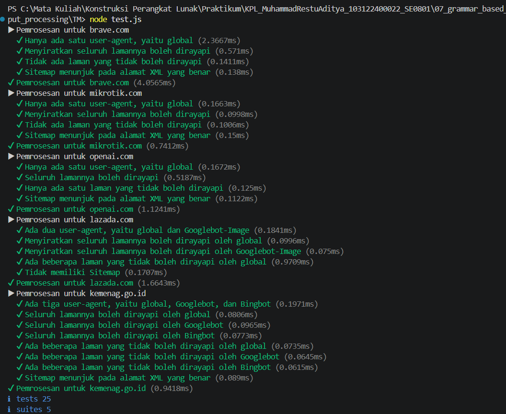

# Tugas Mandiri: Parsing robots.txt

## Identitas

Nama : Muhammad Restu Aditya  
NIM : 103122400022  
Kelas : SE0801  

---

## Deskripsi Tugas

Membuat fungsi `parseRobots(text)` untuk mengubah isi file `robots.txt` menjadi objek JavaScript (POJO).

Properti yang harus dihasilkan:
- `User-agent` → nama bot
- `Allow` → daftar halaman yang boleh diakses
- `Disallow` → daftar halaman yang tidak boleh diakses
- `Sitemap` → daftar URL sitemap

---

## Struktur Proyek




---

## Implementasi Program

### Kode Program

- [index.js](./index.js)
- [structure.d.ts](./structure.d.ts)
- [test.js](./test.js)

---

## Cara Kerja Program

Fungsi `parseRobots` bekerja dengan membaca isi file `robots.txt` baris per baris, kemudian mengelompokkan aturan berdasarkan `User-agent`.

### 1. Membaca dan Memecah Baris

Teks dipecah menjadi array baris menggunakan:
```javascript
text.split('\n')
```
Setiap baris kemudian diproses satu per satu.

### 2. Membersihkan Data
Setiap baris:

Menghapus spasi dengan trim()
Mengabaikan baris kosong
Mengabaikan komentar (#)

### 3. Identifikasi Key dan Value
Setiap baris dipisah berdasarkan : menjadi:

key → seperti user-agent, allow, disallow
value → isi dari key tersebut

Key diubah ke lowercase agar konsisten.

### 4. Pengelolaan User-Agent
Saat menemukan:
```
User-agent: Googlebot
```
Program akan:

Mengubah menjadi lowercase → googlebot
Menyimpan sebagai agent aktif
Membuat struktur jika belum ada


### 5. Penyimpanan Allow dan Disallow
Jika ditemukan:
```
Allow: /
Disallow: /admin/
```
Maka:

Data dimasukkan ke agent yang sedang aktif
Disimpan dalam bentuk array

Jika value kosong, maka diabaikan.


### 6. Penyimpanan Sitemap
Jika ditemukan:
```
Sitemap: https://example.com/sitemap.xml
```
Maka:
- Disimpan ke dalam array Sitemap
- Berlaku global (tidak tergantung agent)


---


## Hasil Output


---

## Deskripsi Program
Program ini digunakan untuk mengubah file robots.txt menjadi struktur data yang mudah diproses oleh program.

Fitur utama:

- Mendukung banyak user-agent
- Mengelompokkan aturan dengan benar
- Mengabaikan data tidak valid
- Mendukung sitemap

---

## Kesimpulan
1. Parsing berbasis baris efektif untuk teks seperti robots.txt
2. Manajemen state penting untuk menjaga konteks agent
3. Normalisasi data menghindari bug parsing
4. Struktur object memudahkan akses data hasil parsing
