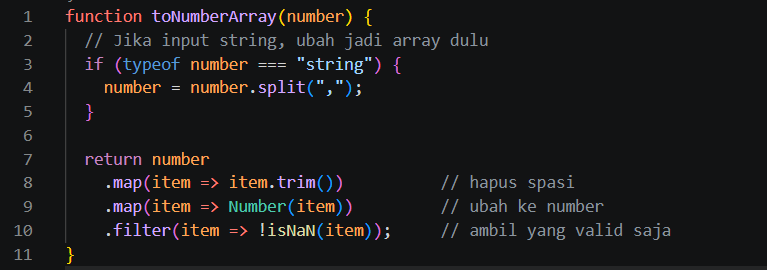
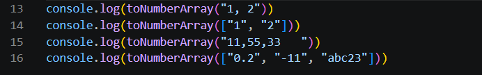
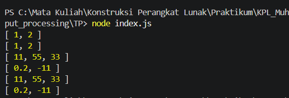

# Tugas Pendahuluan: Konversi String ke Array Number

## Identitas

Nama : Muhammad Restu Aditya  
NIM : 103122400022  
Kelas : SE0801  

---

## Soal

Buat fungsi `toNumberArray(number)` dengan ketentuan:

- Mengubah input menjadi array angka
- Input dapat berupa:
  - String dengan pemisah koma
  - Array berisi string angka
- Harus:
  - Menghilangkan spasi berlebih
  - Mengabaikan nilai yang bukan angka valid
- Mengembalikan array berisi number

---

## Kode Sumber

Tersedia di:

- [index.js](./index.js)

---

# Implementasi Program

## Kode Program



---

## Penjelasan Kode

### Fungsi `toNumberArray`

Fungsi ini digunakan untuk mengubah data bertipe string atau array string menjadi array angka.

#### 1. Cek Tipe Input
```javascript
if (typeof number === "string") {
  number = number.split(",");
}
```
Jika input berupa string:
- Dipisahkan menggunakan split(",")
- Diubah menjadi array

### 2. Menghapus Spasi
```javascript
.map(item => item.trim())
```
Menghilangkan spasi di awal dan akhir string
Contoh: " 11 " → "11"

### 3. Konversi ke Number
```javascript
.map(item => Number(item))
```
Mengubah string menjadi number
Mendukung:
    - angka desimal (0.2)
    - angka negatif (-11)

### 4. Filter Nilai Tidak Valid
```javascript
.filter(item => !isNaN(item))
```
Menghapus nilai yang bukan angka
Contoh: "abc23" akan diabaikan

# Pengujian Program

## Kode Testing


---

## Hasil Output


---

## Skenario Pengujian

| Input                  | Output        | Keterangan             |
|------------------------|--------------|------------------------|
| "1, 2"                 | [1, 2]       | String dengan koma     |
| ["1", "2"]             | [1, 2]       | Array string           |
| "11,55,33"             | [11, 55, 33] | Spasi diabaikan        |
| ["0.2", "-11", "abc23"]| [0.2, -11]   | Nilai invalid dihapus  |
| ""                     | []           | String kosong          |
| ["a", "b"]             | []           | Semua tidak valid      |

---

# Konsep yang Digunakan

## 1. Type Checking

- Menggunakan `typeof` untuk mengecek apakah input string  
- Menentukan cara pemrosesan data  

---

## 2. Array Transformation

- `map()` digunakan untuk:
  - Membersihkan data  
  - Mengubah tipe data  

---

## 3. Data Cleaning

- `trim()` untuk menghapus spasi  
- Memastikan data lebih konsisten  

---

## 4. Filtering Data

- `filter()` digunakan untuk menghapus nilai tidak valid  
- `isNaN()` untuk validasi angka  

---

# Deskripsi Program

Program ini berfungsi untuk mengubah data string menjadi array angka dengan cara yang fleksibel dan aman.

Fitur utama:
- Mendukung berbagai bentuk input  
- Membersihkan data sebelum diproses  
- Mengabaikan nilai yang tidak valid  

Pendekatan ini penting dalam pengolahan data karena data dari user sering tidak konsisten.

---

# Kesimpulan

- Konversi tipe data adalah proses penting dalam pemrograman  
- Validasi dan pembersihan data meningkatkan kualitas output  
- Fungsi menjadi lebih fleksibel dengan mendukung berbagai input  
- Kombinasi `map()` dan `filter()` sangat efektif untuk transformasi data  