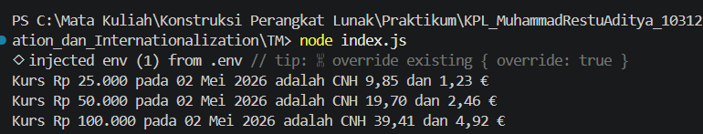

# Tugas Mandiri: Konversi Kurs Mata Uang

## Identitas

Nama : Muhammad Restu Aditya  
NIM : 103122400022  
Kelas : SE0801  

---

## Kode Program
- [index.js](./index.js)

---

## Deskripsi Program

Program ini digunakan untuk menampilkan nilai tukar rupiah (IDR) terhadap mata uang Renminbi Tiongkok (CNH) dan Euro (EUR) berdasarkan data dari API.

Program akan:
- Mengambil data kurs dari API
- Menghitung konversi dari nominal rupiah
- Memformat hasil ke bentuk mata uang dan tanggal
- Menampilkan hasil ke console

---

## Cara Kerja Program

### 1. Mengambil API dari Environment Variable

Program membaca URL API dari file `.env` menggunakan:

```javascript
require('dotenv').config();
const BASE_API = process.env.BASE_API;
```
Hal ini bertujuan agar URL tidak ditulis langsung di dalam kode.

### 2. Mengambil Data dari API

Program melakukan request ke API menggunakan fetch:
```javascript
const response = await fetch(BASE_API);
const data = await response.json();
```
Data yang diterima memiliki struktur:
```JSON
{
  "date": "2026-05-02",
  "idr": {
    "cnh": ...,
    "eur": ...
  }
}
```

### 3. Mengambil Nilai Kurs

Nilai kurs diambil dari properti idr:

```javascript
const rates = data.idr;
```

Kemudian digunakan untuk menghitung konversi:

```javascript
const cnhValue = amount * rates.cnh;
const eurValue = amount * rates.eur;
```

### 4. Formatting Mata Uang

Nilai rupiah diformat menggunakan Intl.NumberFormat:

```javascript
new Intl.NumberFormat('id-ID', {
  style: 'currency',
  currency: 'IDR'
})
```
Nilai EUR juga diformat dengan locale Jerman:

```javascript
new Intl.NumberFormat('de-DE', {
  style: 'currency',
  currency: 'EUR'
})
```
Untuk CNH, digunakan format manual karena tidak selalu didukung oleh Intl.


### 5. Formatting Tanggal
Tanggal dari API diformat menggunakan:
```javascript
new Intl.DateTimeFormat('id-ID', {
  day: '2-digit',
  month: 'long',
  year: 'numeric'
})
```

Sehingga menghasilkan format seperti:
```
02 Mei 2026
```


### 6. Menampilkan Output

Hasil akhir ditampilkan dengan format:

```javascript
console.log(`Kurs Rp25.000 pada 02 Mei 2026 adalah CNH 9,85 dan €1,23`);
```

---

## OUTPUT

