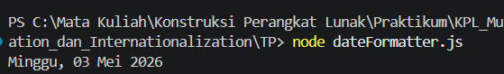

# Tugas Pendahuluan: Format Tanggal dengan Intl.DateTimeFormat

## Identitas

Nama : Muhammad Restu Aditya  
NIM : 103122400022  
Kelas : SE0801  

---

## Deskripsi Tugas

Menampilkan tanggal saat ini dengan format:

Sabtu, 18 April 2026

Ketentuan:
- Menggunakan `Intl.DateTimeFormat`
- Tidak menggunakan formatting manual string
- Format mengikuti bahasa Indonesia

---


## Implementasi Program

### Kode Program

- [dateFormatter.js](./dateFormatter.js)


---

## Cara Kerja Program

Program menggunakan objek `Date` dan API `Intl.DateTimeFormat` untuk memformat tanggal sesuai locale Indonesia.

### 1. Mengambil Waktu Sekarang

```javascript
const sekarang = new Date();
```
Digunakan untuk mendapatkan tanggal dan waktu saat ini dari sistem.

### 2. Menggunakan Intl.DateTimeFormat
```javascript
const formatter = new Intl.DateTimeFormat('id-ID', {
  weekday: 'long',
  day: '2-digit',
  month: 'long',
  year: 'numeric'
});
```
Penjelasan:

a. id-ID → locale Indonesia
b. weekday: 'long' → nama hari (Sabtu)
c. day: '2-digit' → tanggal dua digit (18)
d. month: 'long' → nama bulan (April)
e. year: 'numeric' → tahun (2026)

### 3. Memformat Tanggal
```javascript
const hasilFormat = formatter.format(sekarang);
```
Menghasilkan string tanggal sesuai format yang diinginkan.


### 4. Menampilkan Output
```javascript
console.log(hasilFormat);
```
Menampilkan hasil ke console.

---

## OUTPUT



---

## Deskripsi Program
Program ini digunakan untuk menampilkan tanggal saat ini dalam format yang terstruktur dan sesuai dengan bahasa Indonesia.

Keunggulan:

1. Tidak perlu manual formatting
2. Lebih fleksibel dan standar
3. Mendukung berbagai locale