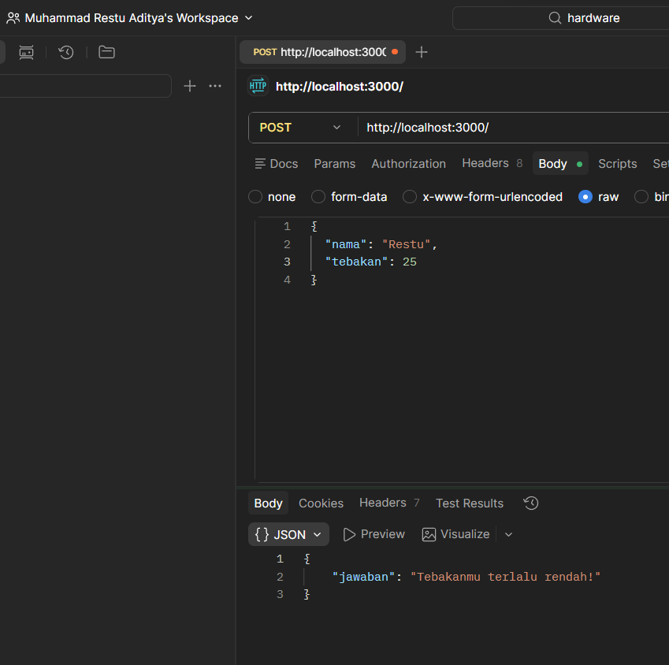
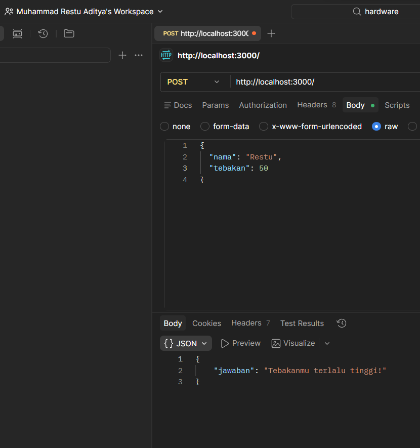
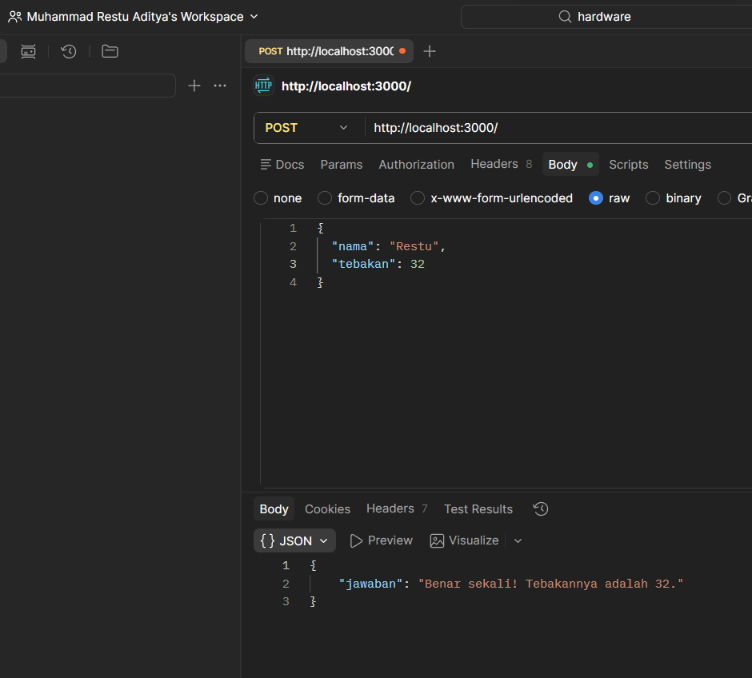

# Tugas Mandiri: API Tebak Angka dengan Express & Swagger

## Identitas

Nama : Muhammad Restu Aditya  
NIM : 103122400022  
Kelas : SE0801  

---

## Kode Program
- [index.js](./index.js)

---

## Deskripsi Program

Program ini merupakan API sederhana menggunakan Express.js untuk permainan tebak angka.

User mengirimkan nama dan angka tebakan melalui endpoint `POST /`. Sistem akan menentukan angka berdasarkan nama secara konsisten, lalu memberikan respon apakah tebakan benar, terlalu tinggi, atau terlalu rendah.

API ini juga dilengkapi dengan dokumentasi Swagger untuk mempermudah pengujian.

---

## Cara Kerja Program

Program berjalan dengan membuat server menggunakan Express, kemudian menyediakan endpoint yang dapat diakses melalui HTTP request.

### 1. Inisialisasi Server

Server dibuat menggunakan Express dan berjalan pada port tertentu (misalnya port 3000).

Ketika server dijalankan, aplikasi siap menerima request dari client seperti Postman atau Swagger UI.

---

### 2. Generate Angka dari Nama

Program menghasilkan angka berdasarkan nama menggunakan perhitungan karakter:

- Setiap huruf diubah menjadi kode ASCII
- Semua nilai dijumlahkan
- Hasil di-modulo 100 lalu ditambah 1

Tujuannya:
- Angka selalu sama untuk nama yang sama
- Tetap berada dalam rentang 1–100
- Bersifat case-sensitive (huruf besar/kecil berbeda)

---

### 3. Endpoint `/`

Endpoint ini menggunakan method `POST`.

Format request:

```json
{
  "nama": "Hamid",
  "tebakan": 24
}
```
Fungsi endpoint:
a. Menerima input nama dan tebakan
b. Menghasilkan angka berdasarkan nama
c. Membandingkan tebakan dengan angka
d. Mengembalikan respon sesuai kondisi

---

### 4. Response API

Kemungkinan response:

a. Tebakan Benar
```JSON
{
  "jawaban": "Benar sekali! Tebakannya adalah 24."
}
```
b. Tebakan Terlalu Tinggi
```JSON
{
  "jawaban": "Tebakanmu terlalu tinggi!"
}
```
c. Tebakan Terlalu Rendah
```JSON
{
  "jawaban": "Tebakanmu terlalu rendah!"
}
```

---

### 5. Dokumentasi Swagger

Swagger digunakan untuk mendokumentasikan API.

Dengan Swagger:

a. Endpoint dapat dilihat secara visual
b. Request dapat dicoba langsung

Swagger dapat diakses melalui:
```
http://localhost:3000/docs
```

---

## Pengujian Program

Pengujian dilakukan menggunakan Postman.

Langkah pengujian:

a. Buka Postman
b. Pilih method POST
c. Masukkan URL:
```
http://localhost:3000/
```
d. Pilih Body → raw → JSON
e. Masukkan data:
```JSON
{
  "nama": "Hamid",
  "tebakan": 24
}
```
f. Klik Send

---

## Hasil
1. Tebakan Terlalu Rendah


2. Tebakan Terlalu Tinggi


3. Tebakan Benar

---

## Konsep yang Digunakan
1. Express.js

Digunakan untuk membuat server dan endpoint API.

2. REST API

Menggunakan method POST untuk mengirim data ke server.

3. Deterministic Function

Menghasilkan angka berdasarkan nama yang:

konsisten
tidak berubah setiap request
4. Data Processing

Menggunakan:

a. charCodeAt() untuk mengambil nilai karakter
b. operasi matematika sederhana untuk menghasilkan angka

5. Swagger (OpenAPI)

Digunakan untuk dokumentasi API yang interaktif.

---

## Kesimpulan
a. API dapat digunakan untuk permainan tebak angka berbasis nama
b. Hasil angka bersifat konsisten untuk setiap nama
c. Endpoint dapat diuji melalui Postman maupun Swagger
d. Express mempermudah pembuatan API sederhana
e. Swagger membantu dokumentasi dan pengujian API secara visual