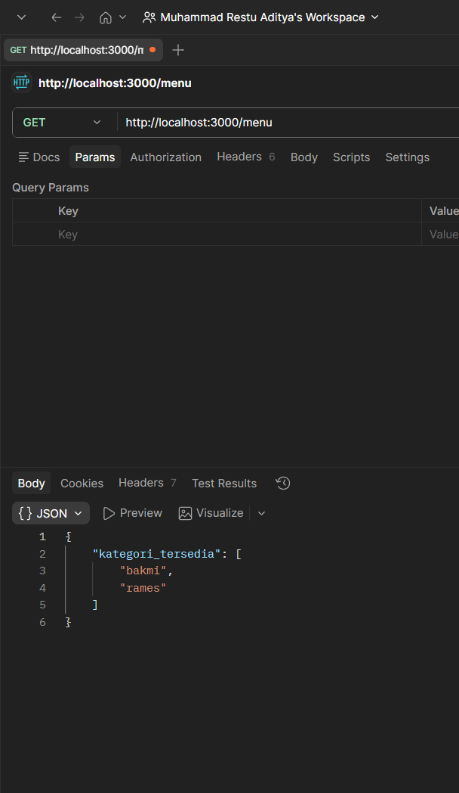

# Tugas Mandiri: API Menu dengan Express & Swagger

## Identitas

Nama : Muhammad Restu Aditya  
NIM : 103122400022  
Kelas : SE0801  

---

## Kode Program
- [index.js](./index.js)
- [swagger.js](./swagger.js)

---

## Deskripsi Program

Program ini merupakan API sederhana menggunakan Express.js yang menyediakan endpoint untuk mengambil daftar kategori menu.

API ini juga dilengkapi dengan dokumentasi menggunakan Swagger sehingga endpoint dapat diuji dan dipahami dengan mudah.

---

## Cara Kerja Program

Program berjalan dengan membuat server menggunakan Express, kemudian menyediakan endpoint yang dapat diakses melalui HTTP request.

### 1. Inisialisasi Server

Server dibuat menggunakan Express dan berjalan pada port tertentu (misalnya port 3000).

Ketika server dijalankan, aplikasi akan siap menerima request dari client seperti browser atau Postman.

---

### 2. Data Menu

Program memiliki data menu dalam bentuk array object, yang berisi nama makanan dan kategorinya.

Contoh:
a. Bakmi Ayam → kategori "bakmi"
b. Mie Goreng → kategori "bakmi"
c. Ramen Jepang → kategori "rames"

---

### 3. Endpoint `/menu`

Endpoint ini menggunakan method `GET`.

Fungsi endpoint:
a. Mengambil semua kategori dari data menu
b. Menghapus duplikasi kategori
c. Mengembalikan hasil dalam bentuk JSON

Proses yang dilakukan:
a. Mapping data untuk mengambil field kategori
b. Menggunakan `Set` untuk menghilangkan duplikasi
c. Mengubah kembali ke array

---

### 4. Response API

Endpoint `/menu` akan mengembalikan data seperti berikut:

```json
{
  "kategori_tersedia": ["bakmi", "rames"]
}
```
---

### 5. Dokumentasi Swagger

Swagger digunakan untuk mendokumentasikan API.

Dengan Swagger:

Endpoint dapat dilihat secara visual
Request dapat dicoba langsung dari browser

Swagger dapat diakses melalui:
```
http://localhost:3000/docs
```

---

## Pengujian Program

Pengujian dilakukan menggunakan Postman.

Langkah pengujian:
a. Buka Postman
b. Pilih method GET
c. Masukkan URL:
```
http://localhost:3000/menu
```
d. Klik Send

---

## Hasil 



---

## Konsep yang Digunakan

### 1. Express.js

Digunakan untuk membuat server dan endpoint API.

### 2. REST API

Menggunakan method GET untuk mengambil data dari server.

### 3. Data Processing

Menggunakan:

a. map() untuk mengambil kategori
b. Set untuk menghapus duplikasi

### 4. Swagger (OpenAPI)

Digunakan untuk membuat dokumentasi API yang interaktif.

Kesimpulan
1. API dapat digunakan untuk mengambil data kategori menu
2. Endpoint dapat diakses melalui browser maupun Postman
3. Swagger mempermudah dokumentasi dan pengujian API
4. Express mempermudah pembuatan server backend sederhana