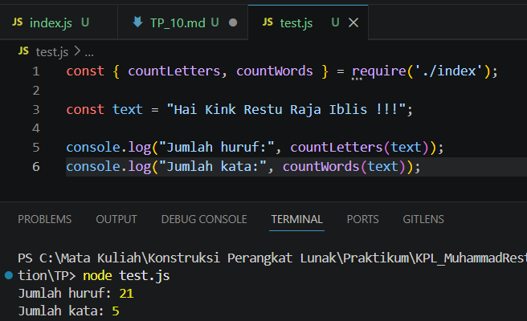

# Tugas Pendahuluan: Library Penghitung Huruf dan Kata

## Identitas

Nama : Muhammad Restu Aditya  
NIM : 103122400022  
Kelas : SE0801  

---

## Soal

Buatlah pustaka JavaScript yang menyediakan utilitas berupa dua fungsi yang menghitung jumlah huruf dan jumlah kata.

Kriteria:

1. Hanya alfabet A hingga Z yang dihitung (besar dan kecil)  
2. Spasi tidak dihitung sebagai huruf  
3. Pustaka dapat diimpor ke file lain  

---

## Kode Program
- [index.js](./index.js)
- [test.js](./test.js)

---

## Deskripsi

Program ini merupakan sebuah library sederhana yang berisi dua fungsi utama, yaitu untuk menghitung jumlah huruf dan jumlah kata dari sebuah teks.

Fungsi countLetters digunakan untuk menghitung jumlah huruf dengan cara menghapus semua karakter selain alfabet. Fungsi countWords digunakan untuk menghitung jumlah kata dengan cara memisahkan teks berdasarkan spasi, lalu memfilter hanya kata yang valid (berisi huruf saja).

Library ini dibuat agar dapat digunakan kembali (reusable) dengan cara di-import ke file lain.

---

## Alur Program
Program menerima input berupa string teks
Untuk menghitung huruf:
1. Menghapus semua karakter selain A-Z menggunakan regex
2. Menghitung panjang string hasil pembersihan

Untuk menghitung kata:
1. Menghapus spasi di awal dan akhir
2. Memisahkan teks menjadi array kata
3. Memfilter hanya kata yang berisi huruf
4. Menghitung jumlah kata valid

Hasil dikembalikan dalam bentuk angka

---

## Output

---

## Penjelasan:

1. Huruf yang dihitung adalah "HelloWorld" sehingga berjumlah 10
2. Kata yang dihitung adalah "Hello" dan "World" sehingga berjumlah 2

---

## Kesimpulan
1. Library ini dapat digunakan untuk menghitung huruf dan kata secara sederhana
2. Hanya karakter alfabet yang dihitung sesuai dengan ketentuan soal
3. Fungsi dibuat reusable sehingga dapat diimpor ke file lain
4. Penggunaan regex mempermudah proses pembersihan dan validasi data